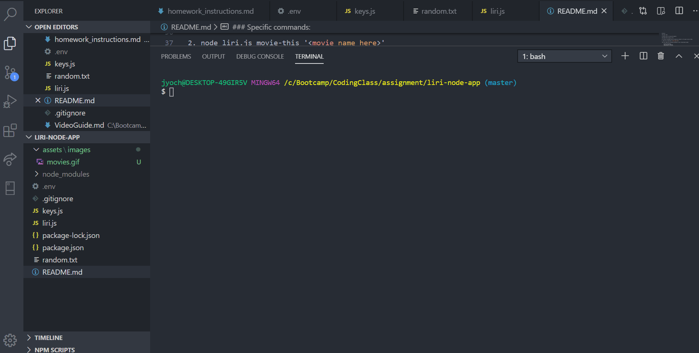
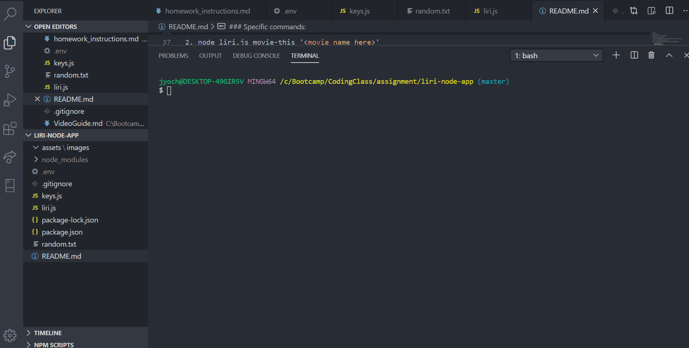

### LIRI NODE APP

LIRI Bot is a command line interface (CLI) application that allows users to search for information about songs, movies, and artists' concert tour schedules within the command line. The information that the command line returns to the user is served via the <a href ="https://developer.spotify.com/documentation/web-api/"> Spotify</a>, <a href="http://www.omdbapi.com/">OMDb </a>, and Bandsintown APIs. Since the application runs in the command line and not a browser, the npm packages axios and node-spotify-api were installed to retrieve API data.

### npm packages used:

1. Moment

Used to format the concert date retrieved from the Bandsintown API

2. DotEnv

Allowed for creation of .env file that was used to store Spotify API keys

3. file-system

Required to read random.txt file that stored information for a random search in the command line

### Specific commands:

1. node liri.js spotify-this-song '<song name here>'

This will show the following information about the song in your terminal/bash window

Artist(s)

The song's name

A preview link of the song from Spotify

The album that the song is from

If no song is provided then your program will default to "The Sign" by Ace of Base.

2. node liri.js movie-this '<movie name here>'

This will output the following information to your terminal/bash window:

    * Title of the movie.
    * Year the movie came out.
    * IMDB Rating of the movie.
    * Rotten Tomatoes Rating of the movie.
    * Country where the movie was produced.
    * Language of the movie.
    * Plot of the movie.
    * Actors in the movie.
If the user doesn't type a movie in, the program will output data for the movie 'Mr. Nobody.'

3. node liri.js concert-this <artist/band name here>

This will show the following information about the song in your terminal/bash window

Artist(s)

The song's name

A preview link of the song from Spotify

The album that the song is from

If no song is provided then your program will default to "The Sign" by Ace of Base.

4. node liri.js do-what-it-says

Using the fs Node package, LIRI will take the text inside of random.txt and then use it to call one of LIRI's commands.

Because of what's currently in the random.txt file, it should run spotify-this-song for "I Want it That Way," as follows the text in random.txt.